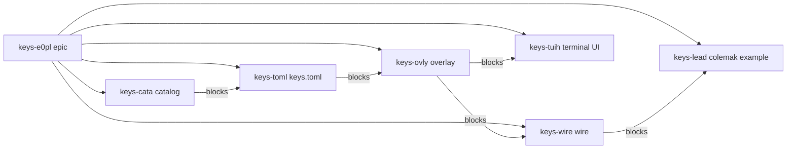
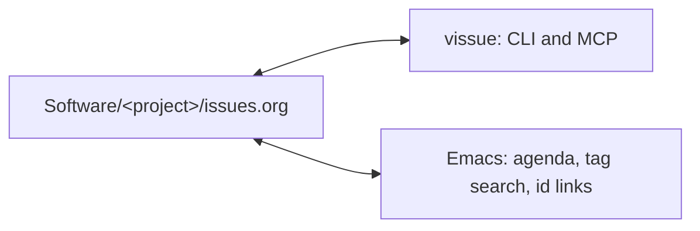

# vissue

<p align="center">
  
</p>

[](https://github.com/HaoZeke/vissue/actions/workflows/ci_test.yml)
[](https://crates.io/crates/vissue-cli)
[](https://docs.rs/vissue-core)
[](https://www.rust-lang.org/)
[](LICENSE)
[](https://vissue.rgoswami.me)

A plan is a directed acyclic graph of org headings. One file per project
stores the nodes. `:PARENT:` groups work under a plan. `:BLOCKED_BY:` is
the partial order. `ready` is the frontier any agent can pick up. `claim`
is the lock so two agents do not take the same node.

An issue is a top-level org heading. The file is the database: no daemon, no
SQLite, no server. Every command parses the files it needs and every mutation
rewrites one file under a lock, so the tracker diffs, merges, and greps like the
rest of the repository it lives in. A CLI and a Model Context Protocol server
share the same library.

The store is an Org file [1]. The graph has several justifications, and
they are not interchangeable. `:PARENT:` plus `:TYPE:` and tags
store the output of hierarchical task-network decomposition [3], [4]:
the agent is the planner, the file is the network. `:BLOCKED_BY:` is a
least-commitment partial order [2]. `ready` and `claim` are a
work-stealing ready deque [9] over that order, which is also how a
rebuild DAG exposes dirty sources [8]. `related` is a named
neighborhood over declared edges, the same discipline as a citation
graph [12], [14], [17] and the opposite of an extracted memory graph
[24], [25], [26]. OokCite is how those papers were found and checked,
not a second reading list to copy.

```
<root>/Software/<project>/issues.org
```

`Software` is the default prefix and is configurable. `<root>` comes from
`--root`, the `VISSUE_ROOT` environment variable, or the current directory.

## A plan on the board

A feature becomes one parent issue and five tagged children. This is the
board an orchestrator shows after that split. Only the catalog is
workable. Everything else waits on an explicit blocker, so two agents
cannot start the terminal UI and the example file at the same time.

| Id | State | What |
|---|---|---|
| `keys-e0pl` | TODO | Epic: Colemak leader sequence |
| `keys-cata` | TODO, ready | Catalog of bindable actions |
| `keys-toml` | BLOCKED on catalog | `keys.toml` schema and key names |
| `keys-tuih` | BLOCKED on overlay | Terminal UI `set_keymap` and overlay `on_key` |
| `keys-lead` | BLOCKED on wire | Leader plus `examples/keys/colemak.toml` |



Solid parent edges are containment. The `blocks` edges are `:BLOCKED_BY:`
and are what `ready` reads. A topological sort is the order the graph
would fire in if every node ran; `ready` is the cheaper question of
which sources are still open. Adding a blocker that would close a
cycle is rejected.

Build that board from an empty directory:

```console
$ mkdir -p /tmp/keys && cd /tmp/keys
$ vissue create --project keys --type plan "Epic: Colemak leader sequence"
keys-e0pl  TODO  [#C]  Epic: Colemak leader sequence
$ vissue create --project keys --type task --parent keys-e0pl --tags catalog \
    "Catalog of bindable actions"
keys-cata  TODO  [#C]  Catalog of bindable actions
$ vissue create --project keys --type task --parent keys-e0pl --tags config \
    "keys.toml schema and key names"
keys-toml  TODO  [#C]  keys.toml schema and key names
$ vissue update keys-toml --block keys-cata
keys-toml: state TODO -> BLOCKED (auto on block), blocked_by += keys-cata
```

Repeat for the overlay, the terminal UI, the wire, and the example file, each
`--parent keys-e0pl` and each `--block` on the node it cannot start
without. Then:

```console
$ vissue ready --project keys
keys-cata              TODO      [#C]  Catalog of bindable actions
$ vissue tree keys-e0pl
keys-e0pl TODO      [#C]  Epic: Colemak leader sequence
  keys-cata TODO      [#C]  Catalog of bindable actions
  keys-toml BLOCKED   [#C]  keys.toml schema and key names
    * blocked-by keys-cata
```

Two workers share that frontier by claiming, not by editing a checklist.
A common pairing is one implementer and one reviewer per node: the
reviewer is a child issue blocked on the implementation issue, so it
becomes ready only when the implementer closes. An identity is an opaque
string, so it can name a person, a machine, or a script; set
`VISSUE_AGENT` to something stable enough to recognise later.

```console
$ VISSUE_AGENT=impl vissue claim keys-cata
claimed keys-cata by impl (TODO -> STARTED)
$ vissue create --project keys --type task --parent keys-cata --tags review \
    "Review the bindable-action catalog"
$ vissue update keys-revw --block keys-cata
$ VISSUE_AGENT=review vissue ready --project keys
# empty: the only open work is claimed or blocked
$ vissue claims --project keys
keys-cata              STARTED   [#C]    0d  impl  Catalog of bindable actions (keys)
```

The tracker does not invent the children. Whoever plans the work splits
it [2], [3], [4]; vissue stores the resulting directed graph, names the
ready set [8], [9], and refuses a cyclic edit [5], [6].

`related` asks what else in the corpus is a neighbor, and why.
Explicit `:PARENT:`, `:BLOCKED_BY:`, `:DISCOVERED_FROM:`, and Org body
links outrank shared tags and rare terms [22]. The command prints the
evidence (`blocked_by`, `org_link`, `term:keymap`) and writes nothing
back [24], [25], [26].

## Install

```console
$ cargo install vissue-cli
$ cargo install vissue-mcp   # the MCP server, same version
```

Tagged releases carry prebuilt archives and a shell installer; see the
[releases page](https://github.com/HaoZeke/vissue/releases). To take unreleased
`main`, name the repository:

```console
$ cargo install --git https://github.com/HaoZeke/vissue vissue-cli
```

Completions and a manual page come out of the binary, so they cannot drift
from it:

```console
$ vissue completions zsh > ~/.zfunc/_vissue
$ vissue man > ~/.local/share/man/man1/vissue.1
```

## Documentation

Full documentation is at **[vissue.rgoswami.me](https://vissue.rgoswami.me)**.

| Page | What it answers |
|---|---|
| [Getting started](https://vissue.rgoswami.me/getting-started) | An empty directory to a backlog two workers share |
| [How-to](https://vissue.rgoswami.me/howto) | One task at a time: filter, share, watch, fold, validate |
| [Reference](https://vissue.rgoswami.me/reference) | Commands, properties, config, export schema, exit statuses |
| [Explanation](https://vissue.rgoswami.me/explanation) | Why the file is the database, and what the citations justify |
| [Emacs](https://vissue.rgoswami.me/emacs) | The agenda, tag search, and `id:` links, with nothing installed |

The sources are Org under `docs/orgmode/`; `bash docs/build.sh` renders the
site.

## A minute of it

```console
$ vissue create --project parser "Reject a manifest with no header"
parser-k29f  TODO  [#C]  Reject a manifest with no header

$ vissue create --project parser --priority A "Publish the release notes"
parser-3xq7  TODO  [#A]  Publish the release notes

$ vissue update parser-3xq7 --block parser-k29f
parser-3xq7: state TODO -> BLOCKED (auto on block), blocked_by += parser-k29f

$ vissue ready
parser-k29f            TODO      [#C]  Reject a manifest with no header
```

`ready` is the open frontier, `claim` is the lock that stops two agents taking
the same node, and the file underneath is ordinary Org that Emacs reads
without help.

## Emacs

A tracker is an ordinary Org file, so Emacs reads it with nothing installed:
deadlines and scheduled dates sit on the planning line, tags in the heading's
own tag run, `#+CATEGORY:` names the project, and `:ID:` resolves through
`org-id`. `org-lint` has nothing to say about a file vissue wrote.



The traffic goes both ways: `C-c C-d`, `C-c C-s`, `C-c C-q`, and marking an
issue DONE under `org-log-done` all work on an issue heading, and vissue reads
back what they write. `tests/org_interop.sh` drives a real Emacs in CI to keep
that true. See [Emacs](https://vissue.rgoswami.me/emacs) for the details,
including what any other tool writing the same file has to respect.

## Contributing

Conventional commits, `cargo fmt`, and `cargo clippy -- -D warnings`. Run
`prek install` for the hooks. The minimum supported Rust version is 1.88.
See [CONTRIBUTING.md](CONTRIBUTING.md) for the interop checks a change to the
command surface or the on-disk shape has to pass.

## Citation

See [CITATION.cff](CITATION.cff).

## License

MIT. See [LICENSE](LICENSE).
