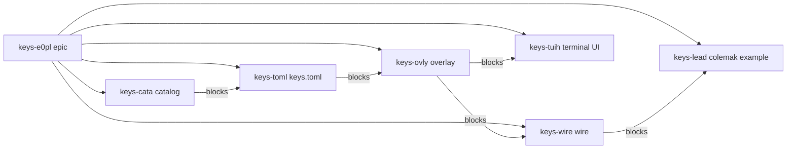
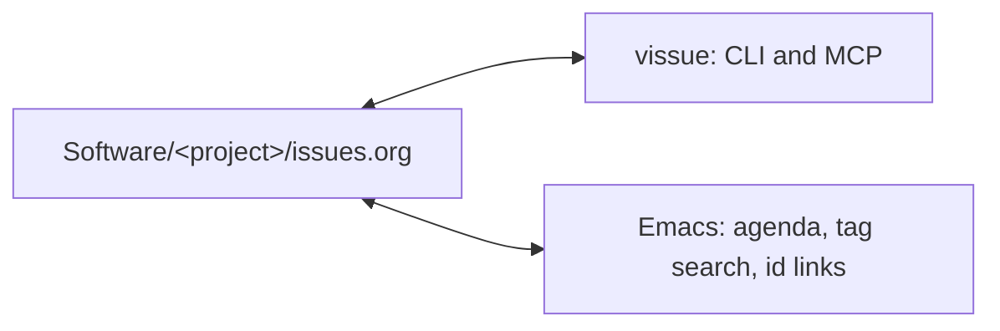

# vissue

<p align="center">
  
</p>

[](https://github.com/HaoZeke/vissue/actions/workflows/ci_test.yml)
[](https://crates.io/crates/vissue-cli)
[](https://docs.rs/vissue-core)
[](https://www.rust-lang.org/)
[](LICENSE)
[](https://vissue.rgoswami.me)

A plan is a directed acyclic graph of org headings. One file per project
stores the nodes. `:PARENT:` groups work under a plan. `:BLOCKED_BY:` is
the partial order. `ready` is the frontier any agent can pick up. `claim`
is the lock so two agents do not take the same node. `recall` is what a
node stands on, walked from those same edges. `:DEEDS:` names what the
work produced, so the next node opens it instead of rereading a
transcript. `consensus` weighs the ballots several agents cast on a node
by how much the group listens to each of them.

An issue is a top-level org heading. The file is the database: no SQLite, no
second store. A command parses the files it needs. An optional `vissue serve`
caches a parse and pushes change notifications; crashing it loses nothing, and
every verb still works with it down. Every mutation rewrites one file under a
lock, so the tracker diffs, merges, and greps like the rest of the repository
it lives in. A CLI and a Model Context Protocol server share the same library.

The store is an Org file [1]. The graph has several justifications, and
they are not interchangeable. `:PARENT:` plus `:TYPE:` and tags
store the output of hierarchical task-network decomposition [3], [4]:
the agent is the planner, the file is the network. `:BLOCKED_BY:` is a
least-commitment partial order [2]. `ready` and `claim` are a
work-stealing ready deque [9] over that order, which is also how a
rebuild DAG exposes dirty sources [8]. `related` is a named
neighborhood over declared edges, the same discipline as a citation
graph [12], [14], [17] and the opposite of an extracted memory graph
[24], [25], [26]. `:DEEDS:` names what a unit of work produced rather
than describing it [30], and `consensus` averages opinions over declared
trust [27], [28], [29]. The numbered sources are in the
[explanation](https://vissue.rgoswami.me/explanation.html); OokCite is
how they were found and checked, not a second reading list to copy.

```
<root>/Software/<project>/issues.org
```

`Software` is the default prefix and is configurable. `<root>` comes from
`--root`, the `VISSUE_ROOT` environment variable, or the current directory.

A user-level `~/.config/vissue/config.toml` can send named projects to a
different checkout. Those routes win over `--root`. `--no-route` keeps
the process on a single layout. See the [reference](https://vissue.rgoswami.me/reference.html).

## A plan on the board

A feature becomes one parent issue and five tagged children. This is the
board an orchestrator shows after that split. Only the catalog is
workable. Everything else waits on an explicit blocker, so two agents
cannot start the terminal UI and the example file at the same time.

| Id | State | What |
|---|---|---|
| `keys-e0pl` | TODO | Epic: Colemak leader sequence |
| `keys-cata` | TODO, ready | Catalog of bindable actions |
| `keys-toml` | BLOCKED on catalog | `keys.toml` schema and key names |
| `keys-tuih` | BLOCKED on overlay | Terminal UI `set_keymap` and overlay `on_key` |
| `keys-lead` | BLOCKED on wire | Leader plus `examples/keys/colemak.toml` |



Solid parent edges are containment. The `blocks` edges are `:BLOCKED_BY:`
and are what `ready` reads. A topological sort is the order the graph
would fire in if every node ran; `ready` is the cheaper question of
which sources are still open. Adding a blocker that would close a
cycle is rejected.

Build that board from an empty directory:

```console
$ mkdir -p /tmp/keys && cd /tmp/keys
$ vissue create --project keys --type plan "Epic: Colemak leader sequence"
keys-e0pl  TODO  [#C]  Epic: Colemak leader sequence
$ vissue create --project keys --type task --parent keys-e0pl --tags catalog \
    "Catalog of bindable actions"
keys-cata  TODO  [#C]  Catalog of bindable actions
$ vissue create --project keys --type task --parent keys-e0pl --tags config \
    "keys.toml schema and key names"
keys-toml  TODO  [#C]  keys.toml schema and key names
$ vissue update keys-toml --block keys-cata
keys-toml: state TODO -> BLOCKED (auto on block), blocked_by += keys-cata
```

Repeat for the overlay, the terminal UI, the wire, and the example file, each
`--parent keys-e0pl` and each `--block` on the node it cannot start
without. Then:

```console
$ vissue ready --project keys
keys-cata              TODO      [#C]  Catalog of bindable actions
$ vissue tree keys-e0pl
keys-e0pl TODO      [#C]  Epic: Colemak leader sequence
  keys-cata TODO      [#C]  Catalog of bindable actions
  keys-toml BLOCKED   [#C]  keys.toml schema and key names
    * blocked-by keys-cata
```

Two workers share that frontier by claiming, not by editing a checklist.
A common pairing is one implementer and one reviewer per node: the
reviewer is a child issue blocked on the implementation issue, so it
becomes ready only when the implementer closes. An identity is an opaque
string, so it can name a person, a machine, or a script; set
`VISSUE_AGENT` to something stable enough to recognise later.

```console
$ VISSUE_AGENT=impl vissue claim keys-cata
claimed keys-cata by impl (TODO -> STARTED)
$ vissue create --project keys --type task --parent keys-cata --tags review \
    "Review the bindable-action catalog"
$ vissue update keys-revw --block keys-cata
$ VISSUE_AGENT=review vissue ready --project keys
# empty: the only open work is claimed or blocked
$ vissue claims --project keys
keys-cata              STARTED   [#C]    0d  impl  Catalog of bindable actions (keys)
```

A claim says who is working. It does not say what to work from, nor what
came of it. `show --org` writes the heading out whole, dispatch note
included, and that file goes to the worker. `append` records the result
back under the heading, dated and attributed, where the next reader
looks. `note` keeps its job: one line in the logbook, the audit trail of
what happened to the issue.

```console
$ vissue show --org keys-cata > ISSUE.org
$ vissue append keys-cata --file SUMMARY.md
keys-cata: appended 12 line(s)
```

Markdown is safe in both directions, and `--file -` reads stdin.

The tracker does not invent the children. Whoever plans the work splits
it [2], [3], [4]; vissue stores the resulting directed graph, names the
ready set [8], [9], and refuses a cyclic edit [5], [6].

`related` asks what else in the corpus is a neighbor, and why.
Explicit `:PARENT:`, `:BLOCKED_BY:`, `:DISCOVERED_FROM:`, a shared deed,
and Org body links outrank shared tags and rare terms [22]. The command
prints the evidence (`blocked_by`, `deed:deed-patch-overlay`,
`term:keymap`) and writes nothing back [24], [25], [26].

## Working memory: what the node stands on

A claim says who is working. It does not say what the work should open first.
The usual answer is to index everything the project ever said and ask, at work
time, which of it resembles the node. The corpus already answers that question
without an index: `:BLOCKED_BY:` is what has to exist first, `:PARENT:` is the
plan the node belongs to, `:DISCOVERED_FROM:` is where a bounce came from.

`recall` walks those three and prints the result. No embedding, no ranking, no
threshold, and nothing to keep in sync: the set is what the plan says, and
every member of it is there for an edge a reader can point at in the file.

Walking a dependency graph for context is not a new idea. What is unusual here
is where the graph comes from: it was written down by whoever split the work,
before any of it ran, and `ready` and `recall` read the same edges. A wrong edge
is not a bad retrieval, it is a node that should never have been startable.

```console
$ vissue recall keys-tuih
keys-tuih              BLOCKED   Terminal UI set_keymap and overlay on_key  (keys)

Plan
  keys-e0pl              TODO      Epic: Colemak leader sequence

Inputs
  keys-ovly              DONE      Overlay on_key  [blocked-by]
    deed-patch-overlay
    note: landed without the modifier table

Produced
  (nothing cited yet)
```

The accession under an input is the handoff.
[deedar](https://github.com/indynull/deedar) mints a **deed** for what a unit
of work produced, freezes it, and issues evidence over its bytes. `deed` cites
that id on the heading; nothing else about the product is copied here, because
the deed store owns it.

```console
$ vissue deed keys-ovly --add deed-patch-overlay
keys-ovly: deeds += deed-patch-overlay
$ deedar get $(vissue recall keys-tuih --deeds-only)
```

The tracker never opens the store, so it cannot say whether a citation still
resolves; `check` only says whether one is shaped like an accession. The store
answers that, over the whole working set at once, and exits non-zero if any of
it fails:

```console
$ vissue recall keys-tuih --deeds-only | deedar evidence -
deed-patch-overlay ok
1 of 1 verified
```

One blocker hop is the default. A deed records its own `sources` and `deedar
trail` walks them, so the rest of the chain is on the deeds, written by the
units that made them rather than reconstructed by the one reading them. The
cost of this design is equally plain: work nobody declared an edge to does not
appear. `related` is the verb for that gap, and it ranks and writes nothing
back [24], [25], [26].

It also means nothing an agent *reads* becomes part of a working set. An entry is
there because an issue declares `:BLOCKED_BY:`, `:PARENT:`, or
`:DISCOVERED_FROM:` naming it, and those are written only by a tracker mutation:
under the lock, by a named identity, with a logbook line. `fold`, the one verb
that ingests a file, writes a title and a body and no edges at all. That does not
make a tracker unattackable, since an agent with write access can declare an
edge, but it makes doing so an act with an author and a diff rather than a side effect
of having read something [36], [37].

## Consensus: whose agreement it is

`vote` counts, and it already refuses to call a plurality agreement. Counting
is the right answer only when every voter is worth the same, and agents are
not. `consensus` weighs the same ballots by who the group listens to, using
DeGroot averaging [27] over a trust graph that lives in the configuration and
is versioned with the work.

```console
$ vissue vote api-3xq7
  consensus: ship (2 of 3)

$ vissue consensus api-3xq7
api-3xq7: 3 ballots over 2 options, trust configured
  count
    ship                     2 (alice, bob)
    hold                     1 (carol)
  consensus after 18 round(s)
    hold                     0.714
    ship                     0.286
  social power
    carol                    0.714
    alice                    0.286
    bob                      0.000
  holds: hold (0.714 of the group's weight)
  the count leads with ship and the group's weight does not
```

Social power is the left Perron vector of the influence matrix [29]: the weight
each ballot actually carried. Nobody listens to `bob`, so `bob` moved the group
by nothing, which is a thing a count cannot say.

The result the model refuses to produce matters as much. DeGroot converges to
agreement exactly when the trust graph holds one closed group every agent can
reach and that group is aperiodic [28]. Two review teams that cite only each
other never converge, and `consensus` reports that rather than averaging across
them. It decides which case holds from the graph's closed components and their
period, not from whether the arithmetic stopped moving, because a group that
mixes slowly stops moving long before its members agree.

Configure nothing and every agent listens to every other equally: the matrix is
doubly stochastic and the consensus is the tally as a fraction.

```toml
[consensus.trust]
reviewer = { maintainer = 3.0, worker = 1.0 }
worker = { maintainer = 1.0 }
```

## Terminal board and HUD

`vissue tui` is a ratatui board over ready, list, claims, agenda, and
search. The detail pane cycles show, excerpt, tree, related, and recall,
so the working set is one key away from the row that names the work, and `d`
cites a deed on the selected issue without leaving the board. It paints from the files first. Unless `--offline`, it then
attaches to `vissue serve`, starting serve when the socket is free. A
socket bound to another root stays on the files so a claim cannot hit
the wrong vault. `q` quits; `?` lists the keys.

`vissue hud` opens on the project list. Opening a project shows that
project's ready forest, then List / Claims / Agenda inside it.
The window is an icedtea overlay: undecorated and always-on-top. On
Sway it floats itself over the IPC socket (`SWAYSOCK`); there is no
compositor include to install. Filters, search, and add sit on one
row. Chrome is
[icedtea](https://crates.io/crates/icedtea) 0.11: chips, cards, markdown,
the search field, and the type scale. The selected row keeps the issue
visible (properties above a wrapping body) with tree / related / notes / recall on the
right. List titles wrap inside the pane. The tree tab expands or collapses
the outline. Escape on the project list unmaps the overlay; `vissue hud
--toggle` (or `--show` / `--hide`) talks to the running owner. Closing the
mapped window quits. `n` opens the logbook and writes a note. Keys
come from a catalog; `~/.config/vissue/keys.toml` (or
`VISSUE_KEYS`) remaps them. `--rofi` is the seat dmenu picker.

```console
$ vissue tui
$ vissue tui --offline
$ vissue hud
$ vissue hud --rofi
$ vissue hud --rofi --mode new
```

## Install

```console
$ cargo install vissue-cli
$ cargo install vissue-hud   # summonable overlay, optional
$ cargo install vissue-mcp   # the MCP server, same version
```

The workspace publishes seven crates at one version:
[`vissue-cli`](https://crates.io/crates/vissue-cli),
[`vissue-mcp`](https://crates.io/crates/vissue-mcp),
[`vissue-hud`](https://crates.io/crates/vissue-hud), and the libraries
[`vissue-core`](https://crates.io/crates/vissue-core),
[`vissue-control`](https://crates.io/crates/vissue-control),
[`vissue-serve`](https://crates.io/crates/vissue-serve),
[`vissue-tui`](https://crates.io/crates/vissue-tui).
Tagged releases carry prebuilt archives (glibc and musl Linux for the CLI
and MCP; the HUD is glibc only) and a shell installer; see the
[releases page](https://github.com/HaoZeke/vissue/releases). To take unreleased
`main`, name the repository:

```console
$ cargo install --git https://github.com/HaoZeke/vissue vissue-cli
```

Completions and a manual page come out of the binary, so they cannot drift
from it:

```console
$ vissue completions zsh > ~/.zfunc/_vissue
$ vissue man > ~/.local/share/man/man1/vissue.1
```

`vissue surface` prints the command line as JSON, one object per subcommand with its
aliases and long flags. Read that from a wrapper or a check rather than parsing help
text, which is laid out for a person.

## Documentation

Full documentation is at **[vissue.rgoswami.me](https://vissue.rgoswami.me)**.

| Page | What it answers |
|---|---|
| [Getting started](https://vissue.rgoswami.me/getting-started) | An empty directory to a backlog two workers share |
| [How-to](https://vissue.rgoswami.me/howto) | One task at a time: filter, share, watch, fold, validate |
| [Reference](https://vissue.rgoswami.me/reference) | Commands, properties, config, export schema, exit statuses |
| [Control](https://vissue.rgoswami.me/control) | Unix socket protocol, framing, and serve / tui / hud |
| [Explanation](https://vissue.rgoswami.me/explanation) | Why the file is the database, and what the citations justify |
| [Emacs](https://vissue.rgoswami.me/emacs) | The agenda, tag search, and `id:` links, with nothing installed |
| [Org syntax](https://vissue.rgoswami.me/org-syntax) | Org 9.8 mapped onto an `issues.org` |
| [Org ecosystem](https://vissue.rgoswami.me/ecosystem) | ELPA / MELPA names the tracker owns, reads, or preserves |

The sources are Org under `docs/orgmode/`; `bash docs/build.sh` renders the
site.

## A minute of it

```console
$ vissue create --project parser "Reject a manifest with no header"
parser-k29f  TODO  [#C]  Reject a manifest with no header

$ vissue create --project parser --priority A "Publish the release notes"
parser-3xq7  TODO  [#A]  Publish the release notes

$ vissue update parser-3xq7 --block parser-k29f
parser-3xq7: state TODO -> BLOCKED (auto on block), blocked_by += parser-k29f

$ vissue ready
parser-k29f            TODO      [#C]  Reject a manifest with no header
```

`ready` is the open frontier, `claim` is the lock that stops two agents taking
the same node, and the file underneath is ordinary Org that Emacs reads
without help.

## Emacs

A tracker is an ordinary Org file, so Emacs reads it with nothing installed:
deadlines and scheduled dates sit on the planning line, tags in the heading's
own tag run, `#+CATEGORY:` names the project, and `:ID:` resolves through
`org-id`. `org-lint` has nothing to say about a file vissue wrote.



The traffic goes both ways: `C-c C-d`, `C-c C-s`, `C-c C-q`, and marking an
issue DONE under `org-log-done` all work on an issue heading, and vissue reads
back what they write. `tests/org_interop.sh` drives a real Emacs in CI to keep
that true. See [Emacs](https://vissue.rgoswami.me/emacs) for the details,
including what any other tool writing the same file has to respect.

## Contributing

Conventional commits, `cargo fmt`, and `cargo clippy -- -D warnings`. Run
`prek install` for the hooks. The minimum supported Rust version is 1.89.
See [CONTRIBUTING.md](CONTRIBUTING.md) for the interop checks a change to the
command surface or the on-disk shape has to pass.

## Citation

See [CITATION.cff](CITATION.cff).

## License

MIT. See [LICENSE](LICENSE).
