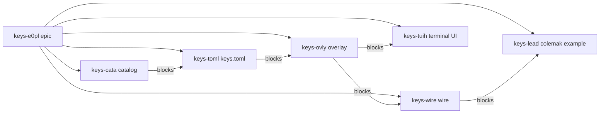
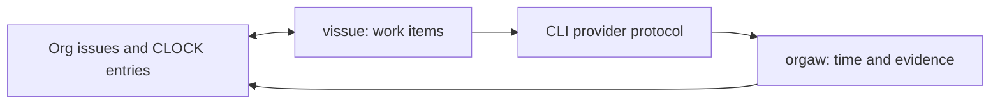

# vissue

[](https://github.com/HaoZeke/vissue/actions/workflows/ci_test.yml)
[](https://crates.io/crates/vissue-cli)
[](https://docs.rs/vissue-core)
[](https://www.rust-lang.org/)
[](LICENSE)

A plan is a directed acyclic graph of org headings. One file per project
stores the nodes. `:PARENT:` groups work under a plan. `:BLOCKED_BY:` is
the partial order. `ready` is the frontier any agent can pick up. `claim`
is the lock so two agents do not take the same node.

An issue is a top-level org heading. The file is the database: no daemon, no
SQLite, no server. Every command parses the files it needs and every mutation
rewrites one file under a lock, so the tracker diffs, merges, and greps like the
rest of the repository it lives in. A CLI and a Model Context Protocol server
share the same library.

The store is the Org document model of Schulte, Davison, Dye, and Dominik
[1]. The dependency edges are a least-commitment partial order [2]: an
agent decomposes a plan into actions and tags them [3]; the tracker
enforces that the resulting graph stays acyclic [4], [5]. `ready` is the
set of sources in what remains, the same shape as a work-stealing ready
deque [6]. `related` is a named local neighborhood over those edges plus
rare terms [8], [9], [10], [11], not a second extracted knowledge graph
[7], [12], [13], [14], [15], [16], [17].

```
<root>/Software/<project>/issues.org
```

`Software` is the default prefix and is configurable. `<root>` comes from
`--root`, the `VISSUE_ROOT` environment variable, or the current directory.

## A plan on the board

A feature becomes one parent issue and five tagged children. This is the
board an orchestrator shows after that split. Only the catalog is
workable. Everything else waits on an explicit blocker, so two agents
cannot start the terminal UI and the example file at the same time.

| Id | State | What |
|---|---|---|
| `keys-e0pl` | TODO | Epic: Colemak leader sequence |
| `keys-cata` | TODO, ready | Catalog of bindable actions |
| `keys-toml` | BLOCKED on catalog | `keys.toml` schema and key names |
| `keys-tuih` | BLOCKED on overlay | Terminal UI `set_keymap` and overlay `on_key` |
| `keys-lead` | BLOCKED on wire | Leader plus `examples/keys/colemak.toml` |



Solid parent edges are containment. The `blocks` edges are `:BLOCKED_BY:`
and are what `ready` reads. Kahn's topological sort [4] is the order the
graph would fire in if every node ran; `ready` is the cheaper question
of which sources are still open. Adding a blocker that would close a
cycle is rejected [5].

Build that board from an empty directory:

```console
$ mkdir -p /tmp/keys && cd /tmp/keys
$ vissue create --project keys --type plan "Epic: Colemak leader sequence"
keys-e0pl  TODO  [#C]  Epic: Colemak leader sequence
$ vissue create --project keys --type task --parent keys-e0pl --tags catalog \
    "Catalog of bindable actions"
keys-cata  TODO  [#C]  Catalog of bindable actions
$ vissue create --project keys --type task --parent keys-e0pl --tags config \
    "keys.toml schema and key names"
keys-toml  TODO  [#C]  keys.toml schema and key names
$ vissue update keys-toml --block keys-cata
keys-toml: state TODO -> BLOCKED (auto on block), blocked_by += keys-cata
```

Repeat for the overlay, the terminal UI, the wire, and the example file, each
`--parent keys-e0pl` and each `--block` on the node it cannot start
without. Then:

```console
$ vissue ready --project keys
keys-cata              TODO      [#C]  Catalog of bindable actions
$ vissue tree keys-e0pl
keys-e0pl TODO      [#C]  Epic: Colemak leader sequence
  keys-cata TODO      [#C]  Catalog of bindable actions
  keys-toml BLOCKED   [#C]  keys.toml schema and key names
    * blocked-by keys-cata
```

Two agents share that frontier by claiming, not by editing a checklist.
A common pairing is one implementer and one reviewer per node: the
reviewer is a child issue blocked on the implementation issue, so it
becomes ready only when the implementer closes. Identities are opaque
strings; set `VISSUE_AGENT` to something stable.

```console
$ VISSUE_AGENT=impl vissue claim keys-cata
claimed keys-cata by impl (TODO -> STARTED)
$ vissue create --project keys --type task --parent keys-cata --tags review \
    "Review the bindable-action catalog"
$ vissue update keys-revw --block keys-cata
$ VISSUE_AGENT=review  vissue ready --project keys
# empty: the only open work is claimed or blocked
$ vissue claims --project keys
keys-cata              STARTED   [#C]    0d  impl  Catalog of bindable actions (keys)
```

The tracker does not invent the children. Hierarchical task-network
planning [3] and partial-order planning [2] are the agent's job. vissue
stores the resulting directed graph, names the ready set, and refuses a cyclic
edit.

`related` answers a different question: given one issue, what else in
the corpus is a neighbor, and why? Explicit `:PARENT:`, `:BLOCKED_BY:`,
`:DISCOVERED_FROM:`, and Org body links outrank shared tags and rare
terms. Term weights follow Sparck-Jones inverse document frequency [8]
and the Salton-Buckley family of tf-idf schemes [9], [10], [11]. The
command prints the evidence (`blocked_by`, `org_link`, `term:keymap`)
and writes nothing back. That is the opposite of Graph RAG, HippoRAG,
LightRAG, Zep, Mem0, and A-MEM [12], [13], [14], [15], [16], [17],
which extract or infer a knowledge graph and then retrieve over it.
vissue keeps Hogan's graph of entities [7] down to the headings a human
already wrote.

Citation-graph ranking [18], [19] is the same discipline at web scale:
follow explicit edges first, treat degree and text as secondary
signals, and do not promote a derived neighbor into the source graph.
`related` is that idea on a few hundred issues, not PageRank over a
citation corpus.

## Install

```console
$ cargo install --git https://github.com/HaoZeke/vissue vissue-cli
```

The MCP server is a second binary in the same workspace:

```console
$ cargo install --git https://github.com/HaoZeke/vissue vissue-mcp
```

## Tutorial: from an empty directory to a tracked backlog

Everything below runs in a scratch directory and touches nothing else.

**1. Make a tracker and create the first issue.**

```console
$ mkdir -p /tmp/demo && cd /tmp/demo
$ vissue create --project parser "Reject a manifest with no header"
parser-k29f  TODO  [#C]  Reject a manifest with no header
file: /tmp/demo/Software/parser/issues.org
```

The file now exists, with a preamble and one heading:

```console
$ cat Software/parser/issues.org
#+TITLE: parser issues
#+FILETAGS: :issues:parser:
#+DATE: [2026-08-03 Mon]
#+DESCRIPTION: Issue tracking file for parser specs, plans, and implementation tasks.
#+STATUS: Active
#+TODO: TODO STARTED BLOCKED | DONE CANCELLED

* TODO [#C] Reject a manifest with no header
:PROPERTIES:
:ID:         parser-k29f
:CREATED:    [2026-08-03 Mon]
:END:
```

**2. Add a second issue that depends on the first.**

```console
$ vissue create --project parser --priority A \
    --body "Scope: the error message quoted in the release notes." \
    "Publish the release notes"
parser-3xq7  TODO  [#A]  Publish the release notes
file: /tmp/demo/Software/parser/issues.org

$ vissue update parser-3xq7 --block parser-k29f
parser-3xq7: state TODO -> BLOCKED (auto on block), blocked_by += parser-k29f
```

Adding a blocker moved the issue to BLOCKED on its own, and the transition is in
the logbook.

**3. Ask what is actually workable.**

```console
$ vissue ready
parser-k29f            TODO      [#C]  Reject a manifest with no header
```

The blocked issue is gone from the list, which is the whole point of `ready`.

**4. Work the issue and close it.**

```console
$ vissue claim parser-k29f
claimed parser-k29f
parser-k29f: state TODO -> STARTED
ID:       parser-k29f
...
$ vissue update parser-k29f --state DONE
parser-k29f: state STARTED -> DONE
[hint] parser-3xq7 (in parser) lists this as a blocker; clear with `vissue update parser-3xq7 --unblock parser-k29f`
```

Closing a blocker names every issue still waiting on it.

**5. Clear the edge and see the backlog open up.**

```console
$ vissue update parser-3xq7 --unblock parser-k29f
parser-3xq7: state BLOCKED -> TODO (auto on unblock), blocked_by -= parser-k29f
$ vissue ready
parser-3xq7            TODO      [#A]  Publish the release notes
```

**6. Share the backlog with someone who cannot read your tracker.**

```console
$ vissue mirror --project parser --out /tmp/demo/backlog-mirror.org
wrote /tmp/demo/backlog-mirror.org
```

That file is a read-only projection with a banner saying so. Regenerate it after
changes; it is output, not a second source of truth.

## How to

**Filter and count.** `--project` (also `-p` or `-P`) and `--state` apply to
`list`, `count`, `ready`, `graph`, `roadmap`, and `export`.

```console
$ vissue list --project parser --state TODO
$ vissue count --ready
```

**Feed another tool.** `export` writes one JSON object per line, carrying every
property, the logbook, the body, and the file line range.

```console
$ vissue export --project parser | jq -r '.id + " " + .state'
```

**Follow the graph.** `tree` walks children and blockers below an id; `graph`
emits the whole thing as Graphviz DOT; `backlinks` finds everything pointing at
an id; `cycles` reports a blocker loop; `ancestors` and `impact` bound the walk
by hop depth.

```console
$ vissue tree parser-3xq7
$ vissue graph --project parser | dot -Tsvg > backlog.svg
$ vissue ancestors parser-3xq7 --depth 3
$ vissue impact parser-k29f --depth 3
```

`related` provides a bounded, derived neighborhood for an issue. Explicit
`:PARENT:`, `:BLOCKED_BY:`, `:DISCOVERED_FROM:`, and Org body links rank above
shared tags and rare terms. The result names its evidence and does not write
inferred links into the source files. Use `--format org` for pasteable Org
links back to the headings:

```console
$ vissue related parser-k29f --depth 2 --limit 20 --format org
```

**Keep the corpus honest.** `check` validates every parent and blocker edge,
every date, and the uniqueness of ids, and exits non-zero on an error.
`hygiene` adds the claims that are not actually workable.

```console
$ vissue check
$ vissue hygiene
```

**Tell whether a copy of the backlog is current.** `digest` hashes the corpus,
combined and per project, so a consumer can compare two points in time without
reading every issue:

```console
$ vissue digest -P atlas -P beacon
combined=7f91ad67512010d0 issues=109 generation=3167 projects=2
6cdab6af46e1c979      12  atlas
671d99c6181c1494      97  beacon
$ vissue digest -P atlas --quiet
d2ee07c7f585330b
```

The per-project lines are the point: a changed combined digest says something
moved, and the sub-digests say which project. The hash is xxh3 over the JSONL
export, so it tracks issue content and ignores formatting that changes nothing.
`--json` gives the same data as an object.

Every mirror carries that digest in its header as a SYNC stamp:

```
# SYNC: digest=d2ee07c7f585330b generation=3167 issues=12 at=2026-08-03T09:53 projects=atlas:6cdab6af46e1c979
```

Which makes freshness a single command, exiting 0 when current and 1 when not:

```console
$ vissue mirror --check Software/atlas/issues-mirror.org
fresh: digest=d2ee07c7f585330b issues=12 generation=3167 (stamped 2026-08-03T09:53)

$ vissue mirror --check stale-copy.org
stale: stale-copy.org
  stamped digest=0000000000000000 at=2026-08-03T09:53 issues=12
  current digest=d2ee07c7f585330b issues=12 generation=3167
  moved: atlas 1111111111111111 -> 6cdab6af46e1c979
```

The check reads the projects from the stamp, so a caller need not repeat them,
and a mirror with no stamp reads as stale. This is what lets a collaborator who
cannot reach the tracker still know whether the copy they hold is behind: run
the check where the tracker lives and share the verdict, or compare stamps
across pulls on their side.

**See who is holding what.** Claiming an issue stamps an identity and a
timestamp onto it, so a backlog worked by several agents shows who took what
and when:

```console
$ vissue whoami
rgoswami@workstation
$ VISSUE_AGENT=grind-worker-3 vissue claim parser-k29f
claimed parser-k29f by grind-worker-3 (TODO -> STARTED)
$ vissue list --state STARTED
parser-k29f            STARTED   [#C]  Reject a manifest...  (claimed 0d by grind-worker-3)
```

The identity comes from `VISSUE_AGENT`, then `agent` in `vissue.toml`, then
`user@host`. It is an opaque string: an agent should set `VISSUE_AGENT` to
something stable enough to recognise across sessions, such as a model and
session tag.

Moving to STARTED by any route takes the claim if no one holds it, so
`vissue update <id> --state STARTED` stamps it too. BLOCKED keeps the claim,
because the holder is still on the issue. Returning to TODO, or closing as
DONE or CANCELLED, gives it up and writes a logbook note naming who held it
and since when, so the history outlives the properties. A claim held by
another identity is refused unless you pass `--force`, which records the
takeover rather than losing it.

`claims` is the standing answer to "who is on what": every live claim, oldest
first, with the holder and the age in days. `--by` and `--project` narrow it,
and `--json` emits the rows as an array for an orchestrator polling agent
state:

```console
$ vissue claims
parser-k29f            STARTED   [#C]    0d  grind-worker-3  Reject a manifest... (parser)
$ vissue claims --by grind-worker-3 --json | jq -r '.[0].claimed_at'
[2026-08-03 Mon 12:52]
```

`hygiene` reports claims held longer than `stale_claim_days` (default 7,
settable in `vissue.toml` or per run with `--stale-days`), and STARTED issues
that nobody has claimed.

**Report progress without taking over.** `note` appends a dated entry to an
issue's logbook and touches nothing else, so an agent can leave a trail on an
issue someone else holds:

```console
$ vissue note parser-k29f "grammar table regenerated; fuzz corpus next"
parser-k29f: noted
```

**Fold discovered work in from outside the tracker.** An agent without write
access to the tracker appends plain `* TODO <title>` headings (body prose
below) to an inbox org file on whatever shared surface it can reach. `fold`
turns each unstamped heading into a tracked issue, then flips the heading to
DONE and stamps it with the assigned id in place, so the inbox doubles as its
own receipt and folding twice creates nothing:

```console
$ vissue fold inbox.org --project parser
folded 2: parser-x1a2 parser-y3b4
```

Like `create`, `fold` auto-detects the project from `.project-ctx.toml`
when `--project` is omitted.

**See what is due.** `agenda` lists open and blocked issues whose
`:DEADLINE:` or `:SCHEDULED:` falls inside a horizon (default 14 days),
overdue first; a blocked issue still appears, because its date does not
stop mattering while it waits:

```console
$ vissue agenda -d 30
2026-07-23  deadline  12d overdue parser-k29f  STARTED  [#A]  Reject a manifest... (parser)
```

**Watch for changes without re-reading everything.** A write advances a
generation counter and appends to a log, both beside the project directories.
A poller compares the counter, then reads only what is new:

```console
$ vissue gen
3167
$ vissue events --since 3155 -n 5
$ vissue wait --last 3167 --timeout-ms 30000   # exits 2 on timeout
$ vissue ping --detail "external change"       # wake pollers by hand
```

Set `VISSUE_EVENTS=0` to suppress emission when the tracker must stay
untouched.

**Point at a different layout.** Use `--prefix`, `VISSUE_PREFIX`, or a
`vissue.toml` at the root:

```toml
prefix = "projects"

[issues]
default_priority = "B"
id_length = 5
```

**Detect the project from the working directory.** With a `.project-ctx.toml`
carrying `[project] name = "..."` in or above the current directory, `--project`
may be omitted.

**Know which tracker you are writing to.** `create`, `update`, `claim`, and
`refile` all write, and claiming counts as a write because it stamps the
holder onto the issue. When a wrapper or the environment sets `VISSUE_ROOT`,
a bare `vissue` writes to that tracker from any directory. Pass `--root`
explicitly for a scratch tracker, and `vissue identity` reports which binary
and which root are in play before you commit to a mutation.

## Reference

### Commands

| Command | Purpose |
|---|---|
| `create`, `q` | Add an issue; `q` prints only the new id |
| `list`, `show` | Rows of issues; one issue's metadata and file range |
| `update`, `claim`, `refile` | Change state, priority, or blockers; take an issue; move it between projects |
| `note` | Append a dated logbook entry; state and claim untouched |
| `claims` | Every live claim, oldest first: who holds what, for how long |
| `fold` | Turn an inbox org file's unstamped `* TODO` headings into issues, stamping in place |
| `whoami` | The identity a claim would record |
| `ready`, `count`, `search`, `children`, `ancestors`, `impact`, `related`, `stale` | Query the corpus; bounded dependency and related traversal |
| `agenda` | Deadlines and scheduled starts inside a horizon, overdue first |
| `export` | JSONL, one object per issue |
| `tree`, `graph`, `cycles`, `backlinks` | Relationships |
| `roadmap`, `mirror` | Markdown roadmap; read-only org or markdown projection |
| `digest`, `mirror --check` | Corpus digest; whether a mirror is still current |
| `check`, `hygiene` | Validation |
| `gen`, `events`, `wait`, `ping` | Change stream for pollers |
| `projects`, `identity` | Layout introspection |

### States and priorities

States are `TODO`, `STARTED`, `BLOCKED`, `DONE`, and `CANCELLED`. An issue is
*ready* when it is `TODO` or `STARTED` and no id in its `:BLOCKED_BY:` is still
open. Priorities are the org cookies `[#A]`, `[#B]`, and `[#C]`, defaulting
to `C`.

### Properties

`:ID:` is required and generated. `:CREATED:` is set on create. `:PARENT:`,
`:BLOCKED_BY:`, `:TAGS:`, `:TYPE:`, `:DEADLINE:`, `:SCHEDULED:`,
`:CLAIMED_BY:`, `:CLAIMED_AT:`, and `:DISCOVERED_FROM:` are read by the query
verbs; any other property is preserved
untouched, in the order it appears on disk. `:BLOCKED_BY:` accepts commas,
whitespace, or both. `:PARENT:` may name another issue or any org heading with
an `:ID:` under the tracker prefix, so a design document can head a work
hierarchy.

### JSONL export schema

Each line is an object with `id`, `project`, `title`, `state`, `priority`,
`properties`, `logbook`, `body`, `line_start`, and `line_end`. Logbook entries
carry `timestamp`, `from`, `to`, and `note`.

### MCP server

`vissue-mcp` speaks MCP over stdio and calls the library in process. It resolves
its root from `VISSUE_ROOT` and `VISSUE_PREFIX`. Tools mirror the CLI verbs:
`vissue_list`, `vissue_ready`, `vissue_show`, `vissue_create`, `vissue_update`,
`vissue_claim`, `vissue_count`, `vissue_search`, `vissue_children`,
`vissue_backlinks`, `vissue_related`, `vissue_waiting_on`, `vissue_body_excerpt`, `vissue_tree`,
`vissue_graph`, `vissue_roadmap`, `vissue_export`, `vissue_check`,
`vissue_hygiene`, `vissue_mirror`, `vissue_projects`, and `vissue_identity`.

## Ecosystem

`vissue` manages intentional work items; [orgaw](https://github.com/HaoZeke/orgaw)
records intentional time and evidence against them. The projects remain
independently installable and communicate through the `vissue` command-line
protocol, with Org issue headings and their CLOCK entries as the shared data.



Install both tools for the integrated path:

```console
$ cargo install vissue-cli
$ cargo install orgaw
$ export ISSUE_ROOT=/path/to/notes
$ vissue ready
$ orgaw issues
$ orgaw in project-id
$ orgaw out
```

## Explanation

### Why the file is the database

A tracker that owns its own store forces a sync problem on everyone who also
wants the data in git. Keeping the org file authoritative removes that problem:
review happens in the diff, history comes from the log, and any editor that
speaks orgmode is a client [1]. Each command pays a linear scan of the
files it needs, which stays cheap until the issue count grows large enough
to notice.

### Why the graph is acyclic

A markdown task list is a total order dressed as a document. A backlog is a
partial order: the terminal UI cannot start before the overlay exists, but
the catalog and an unrelated docs pass can run together [2], [3]. Kahn's
algorithm [4] gives a deterministic prerequisite-first sequence. Tarjan's
coloured depth-first search [5] is how `cycles` reports a true loop and
ignores a diamond. `ready` is not that total order. It is the set of open
sources, which is what several agents need to steal work without a
coordinator [6].

### Why `related` does not write edges

Hogan et al. define a knowledge graph as a graph of real-world entities with
a schema a consumer can query [7]. Issue headings already are such entities.
Extracting a second graph from their prose, the move in Graph RAG, HippoRAG,
LightRAG, Zep, Mem0, and A-MEM [12], [13], [14], [15], [16], [17], would
create a store that drifts from the file. `related` therefore ranks a
bounded neighborhood and names its evidence. Term overlap uses Sparck-Jones
idf [8] and Salton-style weights [9], [10], [11]. Explicit Org relations
outrank those terms. Nothing inferred is written back. That is the same
refusal Brin, Page, and Kleinberg make when they separate the hyperlink
graph from the query [18], [19]: follow declared edges, do not mint them.

### Why `show` does not print the body

`show` returns metadata and `file:line_start-line_end`. An editor or an agent
opens that range when it wants the prose. Keeping prose out of the command
output is what stops a status check from turning into a wall of text.

### Concurrency

Every read-modify-write cycle takes a process-local mutex and an advisory lock
on `issues.org.lock`, then writes through a uniquely named temporary and
renames. Concurrent creates from several processes therefore neither lose
headings nor collide on the temporary file.

## References

1. E. Schulte, D. Davison, T. Dye, and C. Dominik, "A Multi-Language Computing Environment for Literate Programming and Reproducible Research," *Journal of Statistical Software*, 2012, doi: [10.18637/jss.v046.i03](https://doi.org/10.18637/jss.v046.i03).
2. D. S. Weld, "An Introduction to Least Commitment Planning," *AI Magazine*, 1994, doi: [10.1609/aimag.v15i4.1109](https://doi.org/10.1609/aimag.v15i4.1109).
3. K. Erol, J. Hendler, and D. S. Nau, "Complexity results for HTN planning," *Annals of Mathematics and Artificial Intelligence*, 1996, doi: [10.1007/bf02136175](https://doi.org/10.1007/bf02136175).
4. A. B. Kahn, "Topological sorting of large networks," *Communications of the ACM*, 1962, doi: [10.1145/368996.369025](https://doi.org/10.1145/368996.369025).
5. R. Tarjan, "Depth-First Search and Linear Graph Algorithms," *SIAM Journal on Computing*, 1972, doi: [10.1137/0201010](https://doi.org/10.1137/0201010).
6. R. D. Blumofe and C. E. Leiserson, "Scheduling multithreaded computations by work stealing," *Journal of the ACM*, 1999, doi: [10.1145/324133.324234](https://doi.org/10.1145/324133.324234).
7. A. Hogan et al., "Knowledge Graphs," *ACM Computing Surveys*, 2022, doi: [10.1145/3447772](https://doi.org/10.1145/3447772).
8. K. S. Jones, "A statistical interpretation of term specificity and its application in retrieval," *Journal of Documentation*, 1972, doi: [10.1108/eb026526](https://doi.org/10.1108/eb026526).
9. G. Salton and C. Buckley, "Term-weighting approaches in automatic text retrieval," *Information Processing & Management*, 1988, doi: [10.1016/0306-4573(88)90021-0](https://doi.org/10.1016/0306-4573(88)90021-0).
10. G. Salton, A. Wong, and C. S. Yang, "A vector space model for automatic indexing," *Communications of the ACM*, 1975, doi: [10.1145/361219.361220](https://doi.org/10.1145/361219.361220).
11. S. E. Robertson and K. S. Jones, "Relevance weighting of search terms," *Journal of the American Society for Information Science*, 1976, doi: [10.1002/asi.4630270302](https://doi.org/10.1002/asi.4630270302).
12. D. Edge et al., "From Local to Global: A Graph RAG Approach to Query-Focused Summarization," 2024, doi: [10.48550/arXiv.2404.16130](https://doi.org/10.48550/arXiv.2404.16130).
13. B. J. Gutierrez, Y. Shu, Y. Gu, M. Yasunaga, and Y. Su, "HippoRAG: Neurobiologically Inspired Long-Term Memory for Large Language Models," 2024, doi: [10.48550/arXiv.2405.14831](https://doi.org/10.48550/arXiv.2405.14831).
14. Z. Guo, L. Xia, Y. Yu, T. Ao, and C. Huang, "LightRAG: Simple and Fast Retrieval-Augmented Generation," 2024, doi: [10.48550/arXiv.2410.05779](https://doi.org/10.48550/arXiv.2410.05779).
15. P. Rasmussen, P. Paliychuk, T. Beauvais, J. Ryan, and D. Chalef, "Zep: A Temporal Knowledge Graph Architecture for Agent Memory," 2025, doi: [10.48550/arXiv.2501.13956](https://doi.org/10.48550/arXiv.2501.13956).
16. P. Chhikara, D. Khant, S. Aryan, T. Singh, and D. Jain, "Mem0: Building Production-Ready AI Agents with Scalable Long-Term Memory," 2025, doi: [10.48550/arXiv.2504.19413](https://doi.org/10.48550/arXiv.2504.19413).
17. W. Xu, Z. Liang, K. Mei, H. Gao, J. Tan, and Y. Zhang, "A-MEM: Agentic Memory," 2025, doi: [10.48550/arXiv.2502.12110](https://doi.org/10.48550/arXiv.2502.12110).
18. S. Brin and L. Page, "The anatomy of a large-scale hypertextual Web search engine," *Computer Networks and ISDN Systems*, 1998, doi: [10.1016/s0169-7552(98)00110-x](https://doi.org/10.1016/s0169-7552(98)00110-x).
19. J. M. Kleinberg, "Authoritative sources in a hyperlinked environment," *Journal of the ACM*, 1999, doi: [10.1145/324133.324140](https://doi.org/10.1145/324133.324140).

See also the [Org mode manual](https://orgmode.org/manual/), the
[Model Context Protocol](https://modelcontextprotocol.io/),
[petgraph](https://github.com/petgraph/petgraph), and
[daggy](https://github.com/mitchmindtree/daggy).

## Contributing

Conventional commits, `cargo fmt`, and `cargo clippy -- -D warnings`. Run
`prek install` for the hooks. The minimum supported Rust version is 1.88.

## Citation

See [CITATION.cff](CITATION.cff).

## License

MIT. See [LICENSE](LICENSE).
